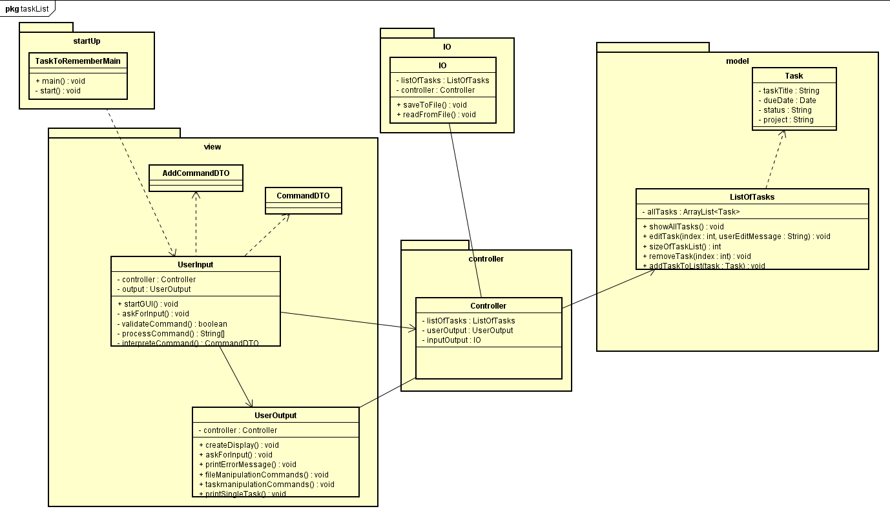

# TaskList
## About the program
The Task's List is useful tool for keeping your daily tasks organized.   
Commands are typed similar as in Linux Bash command line.  First user needs to type command and then specify the options to that command.  
Example of adding a task to the list:  *add sleep 18/03/15 important house*  (**sleep** is a task, **18/03/15** is a due date, **important** is a task status, **house** is a project name the task is grouped in).  
User is able to perform followed tasks to the list:
* add tasks
* edit tasks
* remove tasks
* mark tasks as done
* print tasks in many formats

After performing one of the tasks user can save the list to the file for later use.  
## Architecture
### Class Diagram 

